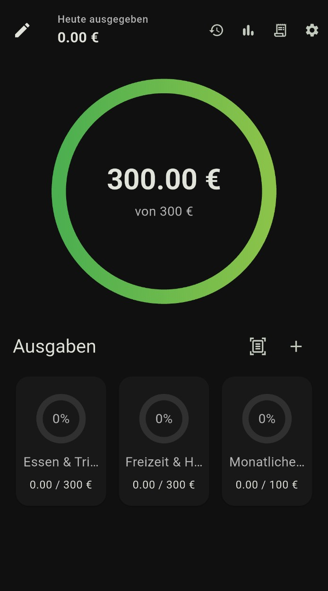
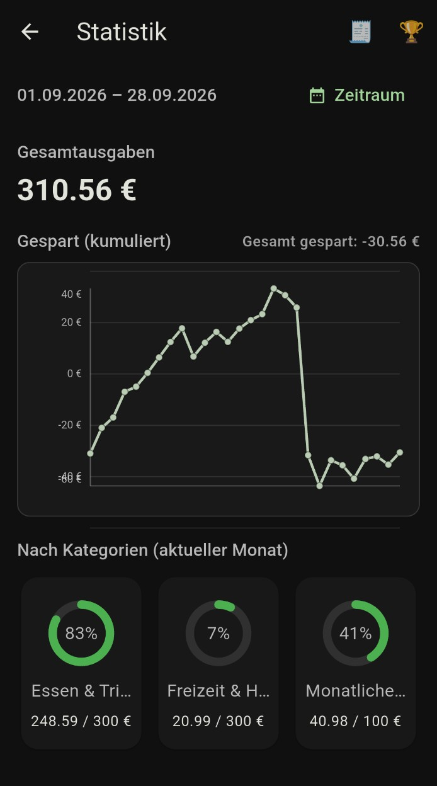
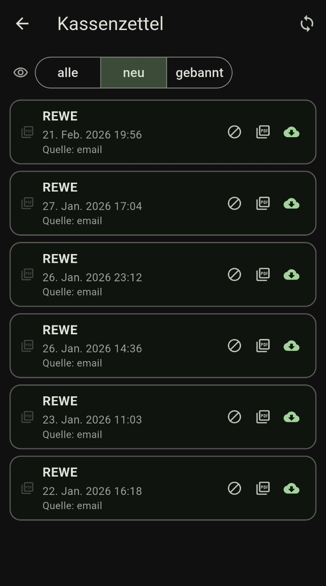
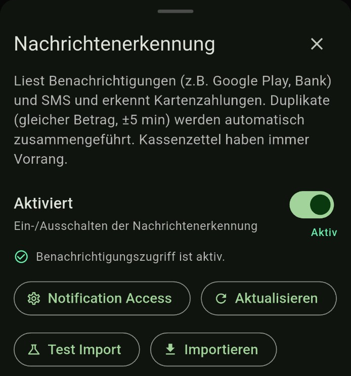

# Finanztracker

**Deine Ausgaben im Blick. Dein Budget im Griff.**

Finanztracker ist eine Android-App für den Überblick über persönliche Ausgaben, Budgets und digitale Kassenzettel. Von der täglichen Budgetkontrolle bis zur Auswertung nach Kategorien bringt sie die wichtigsten Informationen an einem Ort zusammen.

## Auf einen Blick sehen, was noch übrig ist

Die Budgetübersicht zeigt dir direkt, wie viel Geld noch zur Verfügung steht und wie viel du heute bereits ausgegeben hast. Mit eigenen Ausgabenkategorien und passenden Budgets behältst du unterschiedliche Lebensbereiche im Blick.

  

## Verstehen, wohin dein Geld fließt

Wähle einen Zeitraum und betrachte deine Gesamtausgaben sowie den Verlauf deiner kumulierten Ersparnis. Die Kategorienübersicht zeigt zusätzlich, wie viel deiner jeweiligen Monatsbudgets bereits verbraucht ist.

  

## Digitale Kassenzettel gesammelt verwalten

Behalte deine Belege an einem Ort: Die Kassenzettelübersicht listet digitale Belege aus E-Mails mit Händler, Datum und Herkunft auf. Über Filter und den direkten Zugriff auf PDFs findest du deine Belege wieder und kannst sie herunterladen.

  

## Kartenzahlungen automatisch erkennen

Die aktivierbare Nachrichtenerkennung erfasst Kartenzahlungen aus Benachrichtigungen und SMS. Einträge mit gleichem Betrag innerhalb von ±5 Minuten werden als Duplikate zusammengeführt; Kassenzettel haben dabei Vorrang. Für die Erkennung aus Benachrichtigungen wird der entsprechende Android-Zugriff benötigt.

  

